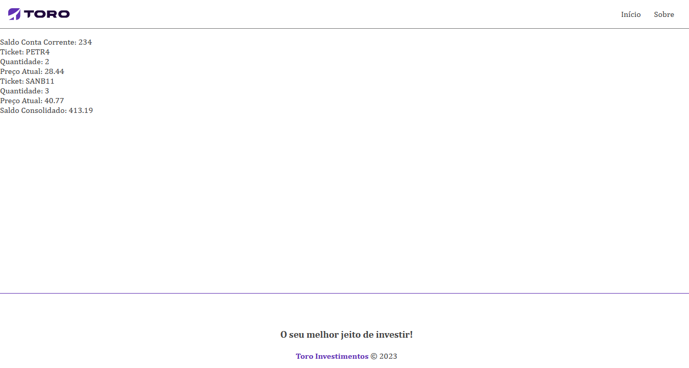

# HomeBroker

A US escolhida foi a _TORO-002_.

TORO-002 - Eu, como investidor, gostaria de visualizar meu saldo, meus investimentos e meu patrimônio total na Toro.

Restrições:
Patrimônio do usuário deve conter as seguintes informações
Saldo atualmente em conta corrente
Lista de ativos (ações) pertencentes ao usuário, com quantidade de cada ativo e valor individual atual de cada um. (Ex: 10 ações PETR4, valor individual R$25,00)
Patrimônio sumarizado (Saldo + Valor totalizado dos ativos)

---

## Execução do projeto

Este projeto foi desenvolvido em Angular version 16.1.7 e .Net 6

- Para executar o backend abra a solution `HomeBroker.sln` no diretório `HomeBroker\backend\HomeBroker.sln` usando Visual Studio e inicie a api `HomeBroker.Api`.

- Para executar o frontend, primeiro instale o pacote `node_modules` no diretório `\HomeBroker\frontend\home-broker` e depois execute o comando `ng serve` para iniciar o frontend.

---

## Visualização

